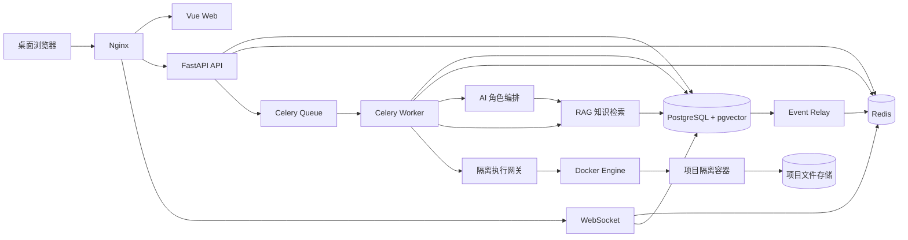
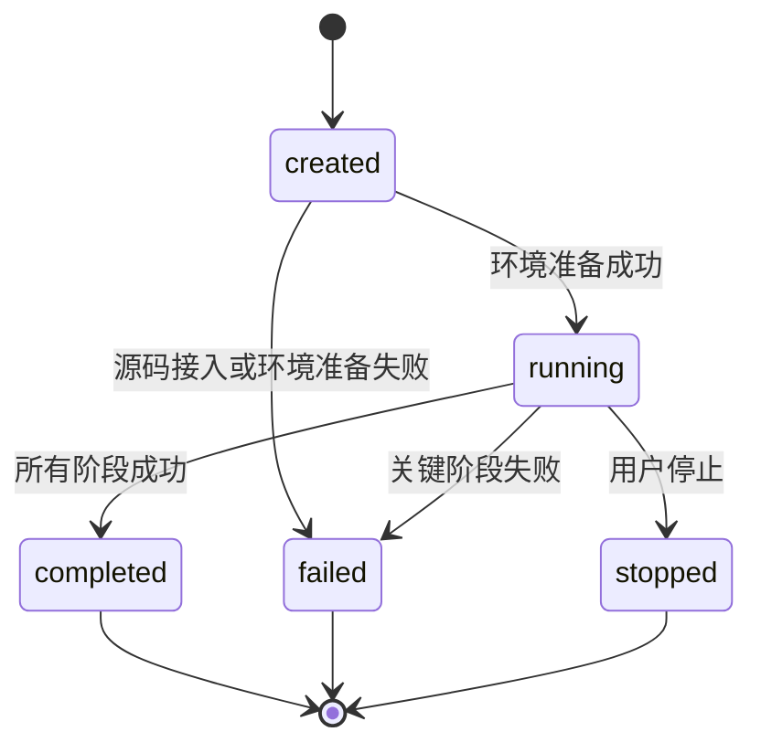
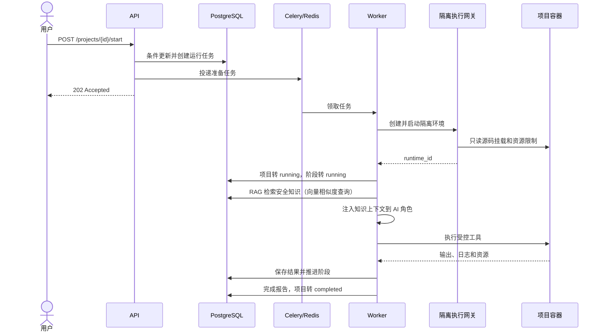

本文档约 7200 字，阅读本文档约 15 分钟。

# 自动化安全评估系统概要设计总纲

## 1. 文档说明

### 1.1 编写目的

本文档基于 `docs/1_PRD/自动化安全评估系统-PRD.md`，确定自动化安全评估系统 MVP 的总体技术路线、系统边界、框架与中间件、核心模块、数据存储和关键数据流程，为后续前端设计、后端设计、数据库设计、接口设计、部署设计和详细设计提供统一基线。

本文档只描述概要级方案。数据库字段、接口请求响应、页面组件、角色提示词、漏洞规则、部署参数等细节在对应模块设计中展开。

### 1.2 设计范围

本期设计覆盖：

- 系统初始化、登录、角色级权限和项目数据权限。
- 本地源码和 Git 仓库两类项目接入方式。
- 项目创建、启动、停止、查询和删除。
- 项目级隔离环境及受控命令执行。
- 环境扫描、代码分析、漏洞验证、报告生成四个执行阶段。
- 六类 AI 执行角色的任务编排、记录和状态汇总。
- 漏洞、攻击路径、报告、日志、消息和资源数据管理。
- REST API、WebSocket 实时消息和断线数据补偿。
- 单机 MVP 部署以及后续横向扩展边界。

多租户、统一身份认证、复测工单、第三方平台深度集成、多项目风险分析和移动端不在本期范围内。

### 1.3 设计依据

- 产品需求：`docs/1_PRD/自动化安全评估系统-PRD.md`
- 原始需求：`docs/0_draft/1.4 自动化安全评估系统.md`
- 目标阶段：MVP
- 默认部署形态：单台 Linux 服务器，以 Docker Compose 管理服务

### 1.4 关键约束

- 原始源码必须只读，任何生成内容只能写入项目工作目录。
- 每个项目使用独立隔离环境，不允许复用其他项目的运行容器。
- 项目、阶段和角色任务状态以 PostgreSQL 中的持久化记录为准。
- Redis、WebSocket 和进程内状态不得作为业务状态的唯一来源。
- 长耗时分析必须异步执行，HTTP 请求只负责校验和受理。
- 停止、失败或服务重启后，已经持久化的结果必须可查询。
- 同一项目同一时刻最多存在一个运行实例。
- MVP 不支持失败项目、已停止项目和已完成项目原地重跑。

## 2. 总体设计目标

### 2.1 功能目标

系统形成从源码接入到报告交付的闭环：

```text
源码接入 → 环境准备 → 环境扫描 → 代码分析 → 漏洞验证 → 攻击路径整理 → 报告生成
```

执行期间持续保存阶段状态、角色任务、交互消息、运行日志、资源用量和分析结果，并通过 WebSocket 向前端推送变化。

### 2.2 质量目标

- 安全隔离：分析任务不能修改原始源码，不能越过项目目录访问宿主机文件。
- 可追溯：漏洞、证据、攻击路径和报告均可追溯到项目、阶段、角色任务和源码位置。
- 可恢复：API 或 WebSocket 重启不影响已进入队列的后台任务；重启后可从数据库恢复查询状态。
- 可观测：关键操作、执行错误、容器资源和模型 token 消耗可查询。
- 可扩展：业务 API、异步 Worker、实时推送和隔离执行之间通过清晰接口解耦。
- 可测试：领域状态机、权限、调度策略和数据转换可在不启动真实容器和模型的情况下测试。

### 2.3 设计原则

- 单体优先、边界清晰：MVP 使用模块化单体 API 和独立 Worker，不提前拆分大量微服务。
- 数据库为事实源：业务状态先持久化，再发送实时事件。
- 控制面与执行面分离：Web API 不直接执行分析命令，也不直接暴露 Docker Socket。
- 阶段串行、阶段内受控并行：阶段严格按顺序推进，同一阶段的角色任务可按配置并发。
- 幂等优先：启动、停止、删除、任务回调和事件消费均使用业务键进行重复保护。
- 最小权限：用户、服务、容器、文件目录和命令执行均只授予完成任务所需权限。

## 3. 技术架构

### 3.1 架构风格

系统采用前后端分离、模块化单体和异步任务架构，由以下运行单元组成：

- `web`：Vue 单页应用，负责用户交互和实时监控展示。
- `api`：FastAPI 应用，负责认证、权限、业务校验、查询和任务受理。
- `worker`：Celery Worker，负责阶段编排、AI 角色调用、RAG 知识检索、报告生成和异步清理。
- `executor`：隔离执行网关，负责容器生命周期、受控文件操作和命令执行。
- `event-relay`：事件投递进程，将数据库事件发布到 Redis Stream。
- `postgres`：保存全部权威业务数据，通过 pgvector 扩展承载安全知识向量库。
- `redis`：提供任务消息、短期实时事件流、取消信号和分布式互斥。
- `nginx`：统一入口，托管前端静态资源并反向代理 API 和 WebSocket。

API 和 Worker 共用同一套领域模型与数据访问层，但分别部署为独立进程。隔离执行网关单独部署，只接受内部网络请求。安全知识库作为 PostgreSQL 的逻辑数据子集，由 Worker 通过领域服务统一管理，不引入独立向量数据库服务。

### 3.2 总体架构图



### 3.3 控制面与执行面

控制面包含 Nginx、Web、API、Worker、PostgreSQL 和 Redis，负责用户请求、业务状态和任务编排。执行面包含隔离执行网关、Docker Engine、项目容器和项目文件目录，负责接触待评估源码并运行受控命令。

API 服务不得挂载 `/var/run/docker.sock`。只有隔离执行网关可以调用 Docker Engine，且网关只提供预定义的容器创建、启动、停止、销毁、文件读取、目录遍历、关键字搜索和受控命令接口。

### 3.4 RAG 分析技术

#### 3.4.1 技术定位

RAG（Retrieval-Augmented Generation，检索增强生成）作为跨阶段分析增强技术，嵌入代码分析和漏洞验证两个关键阶段。在 AI 角色执行分析任务前，RAG 从安全知识库中检索与当前源码上下文最相关的漏洞模式、攻击手法、修复建议和历史评估记录，将其注入角色上下文，提升漏洞识别的准确率和覆盖面。

RAG 作为 Worker 进程内的一个独立应用服务运行，不引入独立的向量数据库或检索服务进程。向量存储、知识条目和检索记录均由 PostgreSQL 统一管理，遵循“数据库为事实源”原则。

#### 3.4.2 知识库构成

安全知识库按来源和用途划分为四个子库：

| 子库 | 来源 | 内容示例 | 更新策略 |
| --- | --- | --- | --- |
| 漏洞模式库 | CVE/NVD、OWASP Top 10、CWE | 漏洞类型签名、危险函数模式、不安全配置模式 | 管理员手动导入或定期同步 |
| 安全规范库 | OWASP Cheat Sheets、语言安全指南 | 安全编码规范、输入校验模式、认证授权最佳实践 | 管理员手动维护 |
| 修复建议库 | 公开修复案例、内部积累 | 漏洞修复代码片段、依赖升级建议、配置加固方案 | 分析结果自动沉淀 |
| 历史评估库 | 本系统已完成评估的项目 | 已验证漏洞特征、攻击路径模式、有效修复方案 | 报告阶段自动入库 |

#### 3.4.3 RAG 检索流程

```text
阶段启动（code_analysis 或 vulnerability_verify）
  │
  ├── 1. 上下文提取
  │     从当前源码片段/候选漏洞中提取检索要素：
  │     - 编程语言与技术栈
  │     - 文件路径模式（如 controller/auth/ 暗示认证相关）
  │     - 关键函数调用（如 eval、system、file_get_contents）
  │     - 变量名与注释中的安全关键词
  │
  ├── 2. 查询构造
  │     将检索要素组合为自然语言查询，调用 Embedding 模型生成查询向量。
  │
  ├── 3. 向量检索
  │     在 pgvector 中执行 ANN 检索，按子库和语言过滤，
  │     召回 top-k（k 由系统配置控制，默认 8）相关条目。
  │
  ├── 4. 重排序与裁剪
  │     按向量相似度 + 规则匹配度（语言、框架、风险类型加权）重新排序，
  │     截断到上下文 token 预算内的最大条目数。
  │
  ├── 5. 上下文注入
  │     将检索结果按固定格式注入对应 AI 角色的 System Prompt 或上下文窗口。
  │
  └── 6. 检索记录
        保存此次检索的项目、阶段、查询摘要、召回条目和相似度分数，
        供后续分析和知识库优化使用。
```

#### 3.4.4 向量存储方案

MVP 使用 PostgreSQL 的 pgvector 扩展作为向量存储，不引入独立的向量数据库：

- **向量维度**：由所选 Embedding 模型决定（默认 1536，对应 OpenAI text-embedding-3-small）。
- **索引类型**：使用 IVFFlat 索引，查询时指定探测数（`ivfflat.probes`）。
- **距离度量**：余弦相似度（`vector_cosine_ops`）。
- **混合检索**：向量相似度为主，辅以结构化字段过滤（语言、框架、风险等级、子库类型）。

选型理由：
- 与 PostgreSQL 共享备份、恢复和事务机制，降低运维成本。
- 知识库条目量级（预计 MVP 阶段数千到数万条）在 pgvector 的舒适区间内，IVFFlat 索引可满足毫秒级检索。
- 避免引入 Qdrant、Milvus 等独立向量数据库的部署和网络复杂度，符合“简单优先”原则。
- 未来条目量增长到十万级以上或需要 HNSW 索引时，可平滑升级（pgvector 0.5+ 已支持 HNSW）。

#### 3.4.5 知识库生命周期

```text
知识录入 ──→ 向量化 ──→ 存储 ──→ 检索使用 ──→ 效果评估 ──→ 更新/淘汰
  │            │         │                      │
  │            │         │                      └── 评估检索命中率和角色采纳率
  │            │         └── knowledge_entries + pgvector 向量字段
  │            └── Embedding 模型生成向量
  ├── 管理员手动录入（漏洞模式、安全规范）
  ├── 评估结果自动沉淀（修复建议、历史评估）
  └── 外部数据源批量导入（CVE/NVD/OWASP）
```

管理员通过系统配置接口管理知识库：新增、编辑、禁用和删除条目。已禁用的条目不参与检索但保留向量数据。自动沉淀的条目需经管理员审核后激活。

#### 3.4.6 Embedding 模型适配

Embedding 模型复用现有的 OpenAI 兼容适配层，与 LLM 调用共享认证、超时和错误处理机制，但独立配置模型名称和速率限制：

- 业务代码只依赖统一的 `EmbeddingPort` 接口。
- 支持 `embed(texts: list[str]) → list[list[float]]` 和 `embed_query(text: str) → list[float]`。
- 向量维度在启动时从首次调用响应中自动检测并校验与数据库 schema 的一致性。
- 知识条目更新时异步重新生成向量，不阻塞检索请求。

## 4. 框架与中间件选型

### 4.1 前端框架

| 分类 | 选型 | 用途与约束 |
| --- | --- | --- |
| 核心框架 | Vue 3、TypeScript | 使用 Composition API 和严格类型检查构建单页应用 |
| 构建工具 | Vite | 本地开发、生产构建和环境变量注入 |
| UI 组件 | Element Plus | 表单、表格、分页、对话框和状态组件 |
| 路由 | Vue Router | 登录页、项目页、监控页、结果页和配置页路由 |
| 状态管理 | Pinia | 保存登录用户、项目概览和页面级共享状态 |
| HTTP 客户端 | Axios | REST 请求、统一错误转换、超时和凭证携带 |
| 实时通信 | 原生 WebSocket 封装 | 心跳、指数退避重连、事件去重和断线补偿 |
| 图表 | Apache ECharts | CPU、内存和 token 使用趋势展示 |
| 单元测试 | Vitest、Vue Test Utils | 组件、Store 和数据转换测试 |
| 端到端测试 | Playwright | 登录、项目流程、监控和报告下载测试 |

前端不保存权威任务状态。Pinia 中的运行状态只用于展示，页面刷新后必须从 REST API 恢复，再建立 WebSocket 订阅。

### 4.2 后端框架

| 分类 | 选型 | 用途与约束 |
| --- | --- | --- |
| 语言 | Python 3.12 | API、调度、AI 角色和报告模块统一语言 |
| Web 框架 | FastAPI | REST API、WebSocket、依赖注入和 OpenAPI 文档 |
| 数据校验 | Pydantic 2 | 请求、响应、配置和内部事件模型 |
| ORM | SQLAlchemy 2 | 数据映射、事务和查询 |
| 数据迁移 | Alembic | 数据库版本迁移；禁止应用启动时隐式改表 |
| 异步任务 | Celery 5 | 长任务投递、阶段执行、失败重试和定时清理 |
| AI 编排 | LangGraph | 描述阶段内角色节点、上下文传递和受控工具调用 |
| 模型接入 | OpenAI 兼容适配层 | 屏蔽具体模型供应商差异，统一超时、重试和 token 统计 |
| 向量存储 | pgvector | PostgreSQL 扩展，存储安全知识条目向量并支持 ANN 检索 |
| Embedding | OpenAI 兼容适配层 | 与 LLM 适配层共用认证和错误处理，独立配置模型与速率限制 |
| 报告模板 | Jinja2、Markdown-it-py | 生成 Markdown 和经过清理的 HTML 报告 |
| 密码处理 | Argon2id | 密码哈希和校验 |
| 测试 | Pytest、HTTPX、Testcontainers | 领域、API、数据库和中间件集成测试 |

LangGraph 只负责单次阶段内的 AI 角色执行图，不保存项目最终状态，也不直接推进项目状态机。项目状态、阶段状态和任务状态仍由调度领域服务在 PostgreSQL 事务中维护。

### 4.3 必选中间件

| 中间件 | 职责 | 是否保存权威业务数据 |
| --- | --- | :---: |
| PostgreSQL | 用户、项目、阶段、任务、漏洞、路径、日志、资源、报告、审计、事件和安全知识向量 | 是 |
| Redis | Celery Broker、短期事件流、取消标记、限流计数和分布式锁 | 否 |
| Docker Engine | 创建项目级隔离容器并执行受限任务 | 否 |
| Nginx | HTTPS 终止、静态文件、反向代理、WebSocket 升级和基础限流 | 否 |

PostgreSQL 通过 pgvector 扩展承载安全知识向量存储和 ANN 检索，不引入独立向量数据库服务。

MVP 不引入 Kafka、Elasticsearch、Kubernetes 和独立日志平台。它们会增加部署与运维成本，当前吞吐量和检索需求不足以支撑引入。

### 4.4 文件存储

MVP 使用宿主机受控数据卷，根目录由部署配置指定，不允许由用户输入。逻辑目录固定为：

```text
runtime_logs/{project_id}/
reports/{project_id}/
workspace/{project_id}/
repositories/{project_id}/
```

- `repositories/{project_id}/` 保存拉取后的源码，只读挂载到项目容器。
- `workspace/{project_id}/` 保存执行中间文件，可读写挂载到项目容器。
- `runtime_logs/{project_id}/` 保存归档日志；可查询日志同时写入 PostgreSQL。
- `reports/{project_id}/` 保存 Markdown、HTML 和可下载报告文件。

文件访问统一经过 `ArtifactStorage` 接口。后续多节点部署可将报告、证据和归档日志替换为 S3 兼容对象存储，业务模块不得直接拼接宿主机绝对路径。

## 5. 逻辑模块划分

### 5.1 前端模块

| 模块 | 主要职责 |
| --- | --- |
| 认证模块 | 初始化、登录、登录态恢复、退出和路由守卫 |
| 项目模块 | 项目创建、列表、详情、启动、停止和删除 |
| 监控模块 | 阶段、角色、消息、日志和资源数据的实时展示 |
| 漏洞模块 | 漏洞列表、筛选、详情、证据和源码位置展示 |
| 攻击路径模块 | 路径列表、利用步骤、关联漏洞和最终影响展示 |
| 报告模块 | 报告状态、在线预览和受权下载 |
| 配置模块 | 管理员读取和更新环境、超时、并发与保留配置 |
| 基础模块 | API 客户端、WebSocket 客户端、错误处理和通用组件 |

### 5.2 后端业务模块

| 模块 | 主要职责 |
| --- | --- |
| `auth` | 初始化管理员、登录、会话校验、角色和项目权限 |
| `projects` | 项目生命周期、源码接入、状态校验和项目统计 |
| `runtimes` | 隔离环境记录、容器生命周期和执行策略 |
| `scheduler` | 阶段状态机、任务分发、并发控制、停止与失败收敛 |
| `agents` | 六类角色定义、上下文组装、工具权限和模型调用 |
| `vulnerabilities` | 漏洞标准化、去重、验证状态和证据保存 |
| `attack_paths` | 同项目漏洞关联、步骤排序和最终影响 |
| `reports` | 数据汇总、模板渲染、文件生成和下载授权 |
| `monitoring` | 日志、消息、资源采样、事件发布和 WebSocket |
| `config` | 系统配置读取、校验、版本记录和运行时快照 |
| `cleanup` | 项目业务数据、容器和文件的幂等清理 |
| `audit` | 关键用户操作和管理操作审计 |
| `knowledge` | 安全知识条目管理、向量化、检索和效果追踪 |

### 5.3 六类执行角色

| 角色标识 | 所属阶段 | 主要输出 |
| --- | --- | --- |
| `general` | 全阶段 | 任务解析、上下文摘要和角色协作消息 |
| `environment_inspector` | `environment_scan` | 技术栈、依赖、目录结构和运行条件 |
| `code_analyst` | `code_analysis` | 候选漏洞、源码位置、初始证据和风险判断（RAG 增强） |
| `vulnerability_verifier` | `vulnerability_verify` | 可达性、触发条件、复现步骤和验证结论（RAG 增强） |
| `report_editor` | `report_generate` | 漏洞汇总、攻击路径、风险结论和修复建议 |
| `operations_assistant` | 环境及全阶段 | 容器操作、受控命令、文件处理和资源采样 |

每次角色调用都创建独立 `worker_tasks` 记录。角色只能使用分配给该角色和阶段的工具集合，不能直接操作数据库、宿主机路径或 Docker Socket。`code_analyst` 和 `vulnerability_verifier` 角色在上下文组装阶段自动触发 RAG 知识检索，检索工具对该两个角色默认启用，其余角色按需配置。

## 6. 核心数据设计

### 6.1 权威数据

PRD 定义的核心表保持不变：

- `users`
- `projects`
- `runtime_stages`
- `worker_tasks`
- `vulnerabilities`
- `attack_paths`
- `attack_path_items`
- `chat_messages`
- `runtime_logs`
- `resource_usages`
- `reports`

概要设计补充以下支撑表，具体字段在数据库设计中确定：

| 支撑表 | 用途 |
| --- | --- |
| `project_runtimes` | 项目与隔离环境编号、容器状态、工作目录和环境快照 |
| `system_configs` | 超时、并发、保留期限、启用环境类型和版本 |
| `audit_logs` | 操作者、操作类型、对象、结果、时间和请求标识 |
| `domain_events` | 事务性事件发件箱、事件序号和投递状态 |
| `file_artifacts` | 报告、证据、归档日志等文件的逻辑键、摘要和大小 |
| `knowledge_entries` | 安全知识条目，包含标题、内容、子库分类、语言、框架、风险等级和 pgvector 向量 |
| `knowledge_retrievals` | RAG 检索记录，包含项目、阶段、查询摘要、召回条目和相似度分数 |

### 6.2 数据关系

- 一个用户可以创建多个项目，一个项目只属于一个创建者。
- 一个项目具有多个阶段记录，但同一运行实例的阶段名称唯一。
- 一个阶段可以分发多个角色任务。
- 一个项目可以保存多个漏洞和攻击路径。
- 一个攻击路径通过 `attack_path_items` 按 `step_order` 关联一个或多个同项目漏洞。
- 日志可以关联项目，并可进一步关联阶段和角色任务。
- 报告、资源、消息、运行环境和文件制品均必须关联有效项目。
- 知识检索记录关联项目和阶段，召回条目关联 `knowledge_entries`。

### 6.3 状态一致性

- 项目、阶段和角色任务状态变更必须在数据库事务内完成。
- 状态变更与 `domain_events` 写入使用同一事务，避免状态成功但实时事件丢失。
- `event-relay` 异步发布事件；重复投递由 `event_id` 和项目内 `sequence` 去重。
- 启动项目使用项目 ID 互斥锁和数据库条件更新，防止重复启动。
- 列表统计从持久化结果计算或由事务同步更新，不依赖 WebSocket 消息计数。
- 时间统一以 UTC 写入数据库，API 返回 ISO 8601 时间并带时区。

## 7. 项目状态与调度设计

### 7.1 项目状态机



项目启动接口受理成功后先创建运行记录和异步任务。只有源码准备与隔离环境启动成功，项目才进入 `running`；准备失败则进入 `failed`。同一项目不能从终态返回 `created`。

### 7.2 阶段调度

阶段顺序固定为：

1. `environment_scan`
2. `code_analysis`
3. `vulnerability_verify`
4. `report_generate`
5. `done`

前一阶段为 `success` 后才能启动后一阶段。关键角色任务失败时，当前阶段转为 `failed`，调度器停止创建后续任务，并将项目收敛为 `failed`。

阶段状态和角色任务状态统一为 `idle`、`running`、`success`、`failed`。用户停止使用项目级取消标记表达，不新增与 PRD 冲突的任务状态；停止中的任务在结果摘要中记录取消原因，项目最终状态为 `stopped`。

### 7.3 并发与重试

- 项目并发数读取管理员配置，达到上限时启动接口返回明确的容量冲突；MVP 不建立隐式无限等待队列。
- 同一项目的阶段串行执行，阶段内部只允许无依赖任务受控并行。
- 数据库死锁、短暂网络错误和模型限流允许有限次数指数退避重试。
- 命令超时、权限拒绝、输入不合法和确定性分析错误不自动重试。
- Celery 任务必须携带 `project_id`、`stage_id`、`worker_task_id`、`request_id` 和幂等键。

## 8. 关键数据流程

### 8.1 初始化与登录流程

1. 前端调用 `POST /api/system/init` 或 `POST /api/system/login`。
2. API 校验系统初始化状态、请求参数和登录限流。
3. 初始化时使用 Argon2id 保存密码哈希；登录时执行恒定时间校验。
4. 登录成功后签发短期访问令牌，通过 `HttpOnly`、`Secure`、`SameSite=Lax` Cookie 返回。
5. 后续请求由认证依赖解析用户，并执行角色和项目归属校验。
6. 初始化、登录成功、连续登录失败和越权访问写入审计日志。

### 8.2 项目创建与源码接入流程

1. 用户提交项目名称、源码类型、源码地址、任务说明和环境类型。
2. API 校验权限、环境类型、路径格式和仓库地址格式。
3. 本地源码仅允许选择管理员配置的根目录下路径；仓库源码由 Worker 拉取到 `repositories/{project_id}/`。
4. 私有仓库凭证只通过受控密钥引用临时注入，不保存到项目表、日志或报告。
5. API 创建 `projects` 记录并返回 `created` 状态。
6. 源码可访问性在启动前再次校验，避免创建后源目录变化。

### 8.3 启动与阶段执行流程



AI 角色读取的是经过裁剪的项目上下文、源码片段和前序结构化结果。工具执行结果先经过大小限制、敏感信息过滤和结构化校验，再进入下一角色上下文。模型自由文本不能直接作为命令执行，命令必须由受控工具根据结构化参数生成并校验。

### 8.4 实时监控流程

1. Worker 在事务中更新状态或结果，同时写入 `domain_events`。
2. `event-relay` 按事件序号发布到项目对应的 Redis Stream。
3. WebSocket 服务校验登录态和项目权限后订阅对应项目事件。
4. 前端按 `event_id` 去重，更新阶段、角色、消息、日志、资源、漏洞和报告状态。
5. WebSocket 断开后自动重连，并携带最后收到的事件序号。
6. Stream 仍保留事件时从下一序号继续推送；超出保留窗口时，前端通过 REST 查询状态、日志、资源和结果进行补偿。

统一事件包至少包含：

```json
{
  "event_id": "uuid",
  "sequence": 1024,
  "event_type": "stage_status",
  "project_id": "uuid",
  "occurred_at": "2026-07-23T08:00:00Z",
  "data": {}
}
```

### 8.5 停止流程

1. API 仅允许停止 `running` 项目，并原子写入停止请求和取消标记。
2. Worker 在角色调用前后、工具执行循环和阶段切换点检查取消标记。
3. 隔离执行网关先向当前进程发送终止信号，等待宽限期后强制终止项目容器内进程。
4. 调度器不再创建新角色任务和后续阶段。
5. 当前任务保存已有输出和停止原因，项目最终转为 `stopped`。
6. 隔离环境按配置停止或销毁，已持久化的漏洞、日志、资源和报告草稿继续保留。

停止采用协作取消加超时强制终止，不依赖 Celery 撤销消息作为唯一机制。

### 8.6 漏洞、攻击路径与报告流程

1. 代码分析角色输出结构化候选漏洞，后端校验风险等级、路径范围和必要字段。
2. 系统按项目、规则类型、文件位置和证据指纹去重，保存为 `pending`。
3. 漏洞验证角色在隔离环境中验证可达性和触发条件，将状态更新为 `verified` 或 `rejected`。
4. 路径模块只允许关联同一项目漏洞，并按连续 `step_order` 保存利用顺序。
5. 报告模块从数据库读取持久化快照，不从前端状态或临时聊天上下文拼装报告。
6. Jinja2 生成 Markdown，Markdown-it-py 转换并清理 HTML，文件写入 `reports/{project_id}/`。
7. 数据库保存报告内容、文件逻辑键、内容摘要和生成状态，成功后发布 `report_ready`。
8. 下载接口先校验项目权限，再由服务端按文件逻辑键返回文件。

### 8.7 删除与清理流程

1. API 拒绝删除 `running` 项目，并要求前端完成二次确认。
2. 删除请求创建幂等清理任务，项目在清理期间禁止其他写操作。
3. Worker 依次销毁隔离环境、清理项目目录和删除关联业务数据。
4. 文件清理记录每个逻辑目录的结果；部分失败时保留失败项并允许重复执行清理任务。
5. 只有容器、文件和数据库关联数据均清理成功后才返回删除完成。
6. 审计日志保留必要的删除操作元数据，不保留被删除项目的敏感内容。

## 9. 接口与实时通信约定

### 9.1 REST 接口

沿用 PRD 的 `/api` 路径，正式设计时统一增加版本前缀 `/api/v1`。写操作返回明确 HTTP 状态：

- 创建成功使用 `201 Created`。
- 异步启动、停止和删除已受理使用 `202 Accepted`。
- 状态冲突使用 `409 Conflict`。
- 参数错误使用 `422 Unprocessable Entity`。
- 未认证使用 `401 Unauthorized`。
- 无权限使用 `403 Forbidden`。
- 资源不存在使用 `404 Not Found`。

统一响应结构：

```json
{
  "code": "PROJECT_START_ACCEPTED",
  "message": "项目启动请求已受理",
  "data": {},
  "request_id": "uuid"
}
```

列表接口使用游标或页码分页。日志和资源接口必须支持时间范围、游标和条数上限。启动、停止和删除接口支持 `Idempotency-Key` 请求头。

### 9.2 WebSocket

WebSocket 地址为 `WS /api/v1/projects/{project_id}/stream`，连接时校验 Cookie 和项目权限。服务端支持心跳、空闲超时、单连接发送缓冲上限和慢客户端断开，防止日志高峰耗尽内存。

消息类型沿用 PRD：

- `project_status`
- `stage_status`
- `worker_status`
- `chat_message`
- `runtime_log`
- `resource_usage`
- `vulnerability_found`
- `report_ready`

### 9.3 API 与任务边界

API 不等待源码拉取、容器创建、源码分析、漏洞验证、报告生成和递归文件清理完成。此类操作均写入任务记录后异步执行，前端通过查询接口和实时事件获得进度。

## 10. 隔离执行与安全设计

### 10.1 容器安全基线

- 每个项目使用独立容器、独立工作目录和独立运行编号。
- 容器进程使用非 root 用户，删除不必要的 Linux Capabilities。
- 启用只读根文件系统、`no-new-privileges`、Seccomp 和进程数限制。
- 源码目录只读挂载，工作目录单独可写挂载。
- 配置 CPU、内存、磁盘、进程数和执行超时上限。
- 默认禁止外网访问；确需下载依赖时通过阶段策略、域名白名单和超时临时开放。
- 禁止挂载宿主机 Docker Socket、密钥目录、系统目录和其他项目目录。
- 容器镜像使用固定摘要并执行漏洞扫描，运行时不接受用户指定任意镜像。

### 10.2 命令与文件安全

- 文件工具使用规范化后的项目内相对路径，并校验真实路径仍位于允许根目录。
- 命令工具采用程序名与参数数组，不拼接 Shell 字符串。
- 对程序、参数、工作目录、环境变量、超时和输出大小分别校验。
- 记录命令策略结果和退出码，敏感参数先脱敏再写日志。
- 单次文件读取、搜索结果、命令输出和模型上下文均设置大小上限。
- 前端展示日志、证据和报告时进行 HTML 清理，不执行结果中的脚本。

### 10.3 认证与数据权限

- 密码仅保存 Argon2id 哈希，不记录明文和完整认证 Cookie。
- 普通使用者默认只能访问本人创建或明确授权的项目。
- 管理员权限不替代项目资源审计，管理员访问敏感项目同样记录审计日志。
- 报告下载、WebSocket 建连和所有项目子资源查询均执行项目权限校验。
- 登录、启动、停止、删除和配置更新执行速率限制。

## 11. 性能、可靠性与可观测性

### 11.1 性能设计

- 普通查询通过索引、分页和字段裁剪满足服务端 P95 不超过 2 秒。
- 创建、启动和停止在 3 秒内返回受理结果，不同步等待后台任务。
- `runtime_logs` 和 `resource_usages` 按项目与时间建立组合索引。
- 资源数据按固定周期采样并批量写入，前端按时间窗口降采样展示。
- 大段证据和报告文件通过文件存储管理，数据库保存可查询正文或摘要及逻辑键。

### 11.2 可靠性设计

- PostgreSQL 定期备份，文件数据卷按相同项目边界备份。
- Celery 任务在业务事务提交后投递，并由幂等键防止重复执行。
- Worker 只有在阶段结果落库后确认任务完成。
- WebSocket 和事件投递失败不回滚已提交业务状态。
- 服务启动时扫描长时间停留在 `running` 的项目和任务，根据容器与心跳记录标记异常并进入人工可诊断状态；不得自动伪造成功。
- 报告失败只使报告阶段和项目失败，已保存漏洞与攻击路径不删除。

### 11.3 可观测性设计

- 全链路使用 `request_id`、`project_id`、`stage_id` 和 `worker_task_id` 关联日志。
- 日志使用 JSON 结构化格式，级别限定为 `debug`、`info`、`warning`、`error`。
- 采集 API 延迟、错误率、队列长度、任务耗时、容器 CPU、内存和模型 token 用量。
- MVP 由 Prometheus 抓取应用指标，Grafana 展示系统级看板；项目监控数据仍从业务接口读取。
- 健康检查区分进程存活和 PostgreSQL、Redis、执行网关等依赖就绪状态。

## 12. 部署设计

### 12.1 MVP 部署拓扑

MVP 使用 Docker Compose 部署在单台 Linux 服务器，至少包含：

```text
nginx
web
api
worker
event-relay
executor
postgres
redis
prometheus
grafana
```

PostgreSQL、项目文件和报告目录使用持久化数据卷。Redis 只保存可重建的队列与短期事件数据，不承担业务恢复。

### 12.2 网络分区

- `public` 网络：只连接 Nginx。
- `app` 网络：连接 Nginx、Web、API、Worker、PostgreSQL 和 Redis。
- `execution` 网络：连接 Worker、隔离执行网关和项目容器。
- PostgreSQL、Redis、执行网关和 Docker Engine 不对宿主机公网端口开放。

### 12.3 扩展路径

当单机容量不足时，优先按以下顺序扩展：

1. 增加 Celery Worker，并按任务类型拆分队列。
2. 将报告、证据和归档日志迁移至 S3 兼容对象存储。
3. 将隔离执行网关部署到多个执行节点，并引入节点资源调度。
4. 将 API 和 WebSocket 服务横向扩容。
5. 只有事件吞吐和保留需求超过 Redis Stream 能力后，再评估 Kafka。

## 13. 建议工程目录

```text
sas-system/
├── apps/
│   ├── web/
│   ├── api/
│   ├── worker/
│   └── executor/
├── packages/
│   ├── backend-core/
│   └── contracts/
├── migrations/
├── deploy/
│   ├── compose/
│   └── nginx/
├── tests/
│   ├── integration/
│   └── e2e/
├── docs/
│   ├── 1_PRD/
│   ├── 2_原型图/
│   ├── 3_概要设计/
│   ├── 4_开发规范/
│   └── 5_各模块的文档/
└── README.md
```

后端共享代码不得通过复制在 API 和 Worker 之间同步，应集中在 `backend-core`。前后端共享的枚举、事件结构和 OpenAPI 生成类型放在 `contracts`。

## 14. 后续设计交付物

概要总纲评审通过后，按以下顺序补充设计文档：

1. 系统架构与部署图。
2. 数据库表结构、索引、约束和迁移设计。
3. REST API、WebSocket 事件和统一错误码设计。
4. 后端模块、领域状态机和异步任务详细设计。
5. 前端页面、路由、状态管理和组件详细设计。
6. 隔离执行协议、容器安全策略和命令策略设计。
7. AI 角色、工具权限、上下文格式和输出 Schema 设计。
8. 报告模板与文件生命周期设计。
9. 测试方案、验收用例和演示链路。
10. 运维监控、备份恢复和故障处理手册。

## 15. 需求追踪

| PRD 需求域 | 概要设计承载位置 |
| --- | --- |
| 认证与初始化 | `auth`、认证数据流、认证与数据权限 |
| 项目管理 | `projects`、项目创建数据流、项目状态机 |
| 隔离环境与执行 | `runtimes`、`executor`、隔离执行与安全设计 |
| 调度与角色任务 | `scheduler`、`agents`、阶段调度和并发重试 |
| 实时监控 | `monitoring`、事务性事件、Redis Stream 和 WebSocket |
| 漏洞与攻击路径 | `vulnerabilities`、`attack_paths` 和结果数据流 |
| 报告 | `reports`、文件存储和报告数据流 |
| 系统配置 | `config`、`system_configs` 和运行时配置快照 |
| 知识库与RAG | `knowledge`、第 3.4 节 RAG 分析技术、`knowledge_entries` 和 `knowledge_retrievals` |
| 性能与可靠性 | 性能、可靠性、可观测性和部署设计 |
| 删除与保留 | `cleanup`、删除数据流和文件存储 |

## 16. 待确认事项与设计决策

以下事项会影响详细设计，必须在对应模块开发前确认：

- 本地源码允许访问的宿主机根目录和目录授权方式。
- 私有 Git 仓库的认证方式、凭证托管位置和凭证销毁策略。
- 项目容器是否允许临时外网访问，以及依赖下载域名白名单。
- CPU、内存、磁盘、进程数、命令超时和项目并发默认值。
- 模型供应商、模型列表、单项目 token 预算和敏感源码出域策略。
- 漏洞风险评级标准、同类漏洞去重规则和验证通过标准。
- 报告最终下载格式；MVP 默认提供 Markdown 和 HTML，PDF 需单独确认。
- 停止后的容器保留策略和文件默认保留期限。
- 普通使用者之间的项目共享与授权规则。

未经确认的事项必须使用配置或接口隔离，不得在业务代码中写死供应商、绝对路径、容器镜像、模型名称或资源配额。

- Embedding 模型供应商、模型名称和向量维度。
- 安全知识库初始条目录入来源和审核流程。
- RAG 检索的 top-k 默认值、相似度阈值和子库权重。
- 知识条目自动沉淀（历史评估库）的审核策略。
- pgvector 索引类型（IVFFlat/HNSW）和索引构建频率。
