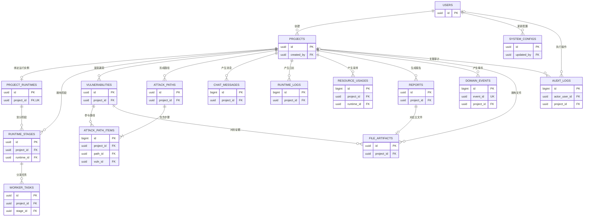
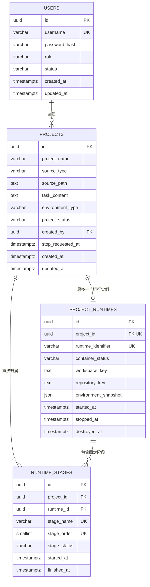
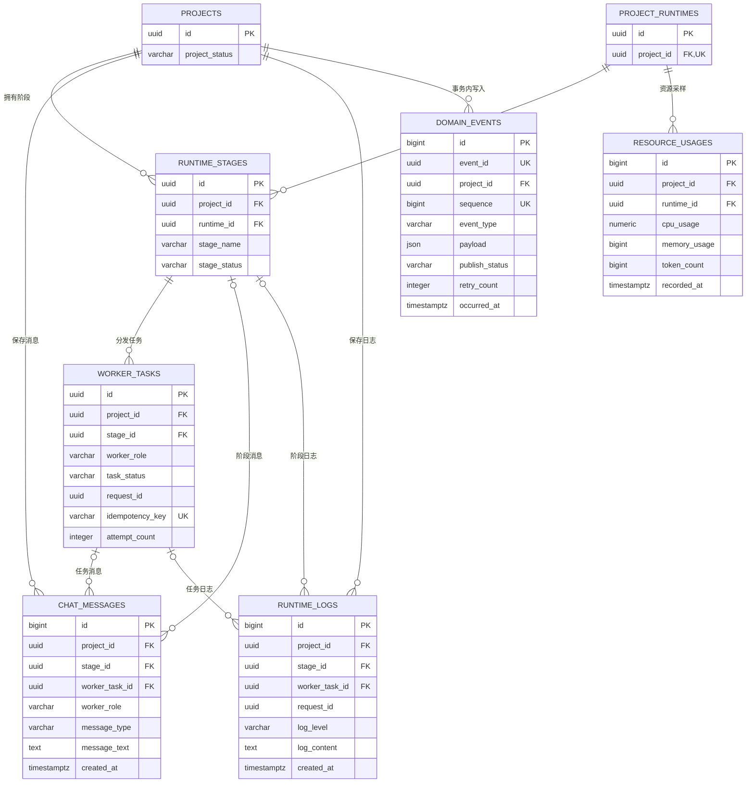
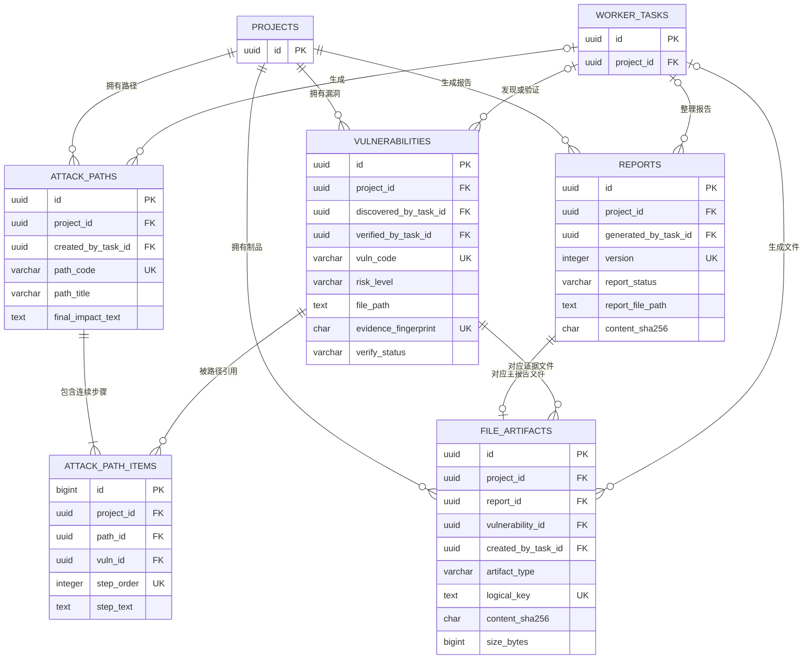
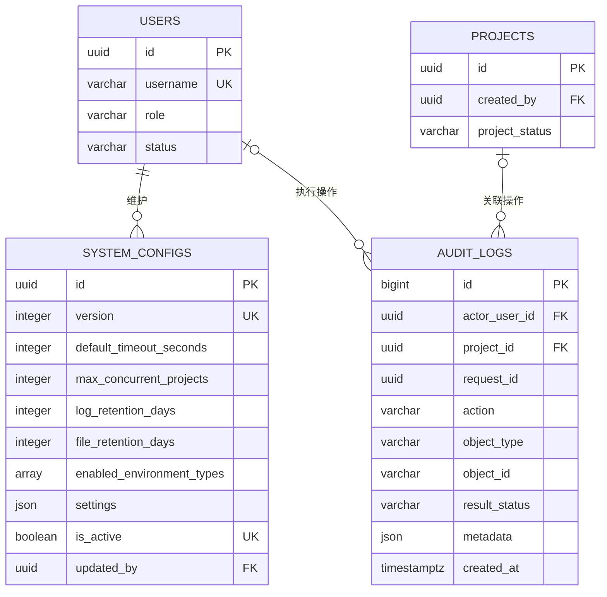

本文档约 12000 字，阅读本文档约 24 分钟。

# 自动化安全评估系统 ER 图

## 1. 目的与范围

本文档描述自动化安全评估系统 MVP 的 16 张 PostgreSQL 表及其基数、外键、唯一性和删除关系。总览图用于理解领域边界，领域图展示关键字段。完整字段类型、约束和索引以 `数据库设计.md` 与 `初始化sql.md` 为准。

## 2. 实体分组与图例

| 分组 | 实体 |
| --- | --- |
| 用户与项目 | `users`、`projects` |
| 运行与调度 | `project_runtimes`、`runtime_stages`、`worker_tasks` |
| 监控与事件 | `chat_messages`、`runtime_logs`、`resource_usages`、`domain_events` |
| 安全结果 | `vulnerabilities`、`attack_paths`、`attack_path_items` |
| 报告与文件 | `reports`、`file_artifacts` |
| 配置与审计 | `system_configs`、`audit_logs` |

Mermaid 键标记中，`PK` 表示主键，`FK` 表示外键，`UK` 表示唯一键。基数符号含义如下：

| 符号 | 含义 |
| --- | --- |
| `||` | 有且仅有一个 |
| `o|` | 零或一个 |
| `|{` | 一个或多个 |
| `o{` | 零或多个 |

## 3. 系统级实体关系总览

## 4. 用户、项目、运行环境与执行阶段

`project_runtimes.project_id` 唯一，落实 MVP 每项目最多一个运行实例。`runtime_stages` 通过 `(runtime_id, project_id)` 复合外键保证运行实例和项目一致；同一运行实例的 `stage_name`、`stage_order` 分别唯一。

## 5. 角色任务、消息、日志、资源与领域事件

消息和日志允许仅关联项目，也允许进一步关联阶段及任务。任务非空时阶段必须非空，三列复合外键保证任务、阶段和项目一致。`domain_events` 使用全局 `event_id` 和项目内 `(project_id, sequence)` 双重去重。

## 6. 漏洞、攻击路径、报告与文件制品

`attack_path_items` 同时通过 `(path_id, project_id)` 和 `(vuln_id, project_id)` 引用父表，数据库层阻止跨项目攻击路径。每条路径在事务提交时必须至少有一步，步骤必须从 `1` 连续。

## 7. 系统配置与审计

`system_configs` 通过部分唯一索引保证最多一个 `is_active = true` 的版本。审计外键使用 `ON DELETE SET NULL`，项目删除后仍保留脱敏对象标识、请求标识、操作和结果。

## 8. 实体关系说明

| 主实体 | 从实体 | 基数 | 外键 | 可空 | 删除策略 | 业务说明 |
| --- | --- | --- | --- | :---: | --- | --- |
| `users` | `projects` | 1:N | `created_by` | 否 | RESTRICT | 一个用户创建多个项目 |
| `projects` | `project_runtimes` | 1:0..1 | `project_id` | 否 | CASCADE | MVP 每项目最多一个运行实例 |
| `project_runtimes` | `runtime_stages` | 1:N | `(runtime_id, project_id)` | 否 | CASCADE | 运行实例包含固定阶段 |
| `runtime_stages` | `worker_tasks` | 1:N | `(stage_id, project_id)` | 否 | CASCADE | 阶段分发多个角色任务 |
| `worker_tasks` | `vulnerabilities` | 0..1:N | 发现、验证任务复合 FK | 是 | NO ACTION | 漏洞追溯至角色任务 |
| `projects` | `vulnerabilities` | 1:N | `project_id` | 否 | CASCADE | 项目保存漏洞 |
| `projects` | `attack_paths` | 1:N | `project_id` | 否 | CASCADE | 项目保存攻击路径 |
| `attack_paths` | `attack_path_items` | 1:1..N | `(path_id, project_id)` | 否 | CASCADE | 路径至少一个连续步骤 |
| `vulnerabilities` | `attack_path_items` | 1:0..N | `(vuln_id, project_id)` | 否 | CASCADE | 漏洞可参与多条路径 |
| `projects` | `chat_messages` | 1:N | `project_id` | 否 | CASCADE | 项目消息历史 |
| `runtime_stages` | `chat_messages` | 0..1:N | `(stage_id, project_id)` | 是 | CASCADE | 可选阶段消息 |
| `worker_tasks` | `chat_messages` | 0..1:N | 三列范围 FK | 是 | CASCADE | 可选任务消息 |
| `projects` | `runtime_logs` | 1:N | `project_id` | 否 | CASCADE | 项目日志 |
| `runtime_stages` | `runtime_logs` | 0..1:N | `(stage_id, project_id)` | 是 | CASCADE | 可选阶段日志 |
| `worker_tasks` | `runtime_logs` | 0..1:N | 三列范围 FK | 是 | CASCADE | 可选任务日志 |
| `project_runtimes` | `resource_usages` | 1:N | `(runtime_id, project_id)` | 否 | CASCADE | 运行实例资源序列 |
| `projects` | `reports` | 1:N | `project_id` | 否 | CASCADE | 项目报告版本 |
| `reports` | `file_artifacts` | 1:0..1 | `(report_id, project_id)` | 是 | CASCADE | 报告就绪后对应主文件 |
| `vulnerabilities` | `file_artifacts` | 1:0..N | `(vulnerability_id, project_id)` | 是 | CASCADE | 漏洞证据文件 |
| `projects` | `domain_events` | 1:N | `project_id` | 否 | CASCADE | 项目 Outbox 事件 |
| `users` | `system_configs` | 1:N | `updated_by` | 否 | RESTRICT | 管理员维护配置版本 |
| `users` | `audit_logs` | 0..1:N | `actor_user_id` | 是 | SET NULL | 用户删除后保留审计 |
| `projects` | `audit_logs` | 0..1:N | `project_id` | 是 | SET NULL | 项目删除后保留审计 |

## 9. 关键约束

- `project_runtimes.project_id` 唯一，防止 MVP 项目原地重跑。
- `runtime_stages` 固定名称与 `stage_order` 映射，并要求状态与起止时间一致。
- `worker_tasks` 以项目内 `idempotency_key` 去重。
- `vulnerabilities` 以项目内 `vuln_code` 和 `evidence_fingerprint` 双重唯一。
- `attack_paths` 以项目内 `path_code` 唯一。
- `attack_path_items` 使用复合外键保证同项目，延迟约束保证至少一步且步骤连续。
- `domain_events.event_id` 全局唯一，`(project_id, sequence)` 项目内唯一。
- `system_configs` 最多一个生效版本。
- `reports` 在 `ready` 时必须同时具有 Markdown、HTML、文件逻辑键和 SHA-256。
- `file_artifacts.logical_key` 全局唯一，禁止绝对路径和路径穿越。
- `audit_logs` 在用户或项目删除后保留最小脱敏上下文。

## 10. 设计假设与待确认事项

- 技术角色值使用 `user`、`admin`，账户状态使用 `active`、`disabled`。
- 容器、报告、审计结果、Outbox 投递和文件类型的闭集是详细设计补充，需后端协议评审。
- `chat_messages.message_type` 尚未定义闭集，当前不在 ER 图中假设具体枚举。
- 普通用户间项目共享规则未确定，因此未新增授权关系实体。
- 本地源码授权根目录、私有仓库凭证托管、网络白名单、资源配额、并发值和保留周期仍待部署及安全评审。
- 漏洞去重指纹算法需在漏洞规则库确定后固化。
- 报告仅确定 Markdown 和 HTML；PDF 不在 MVP 数据关系中。
